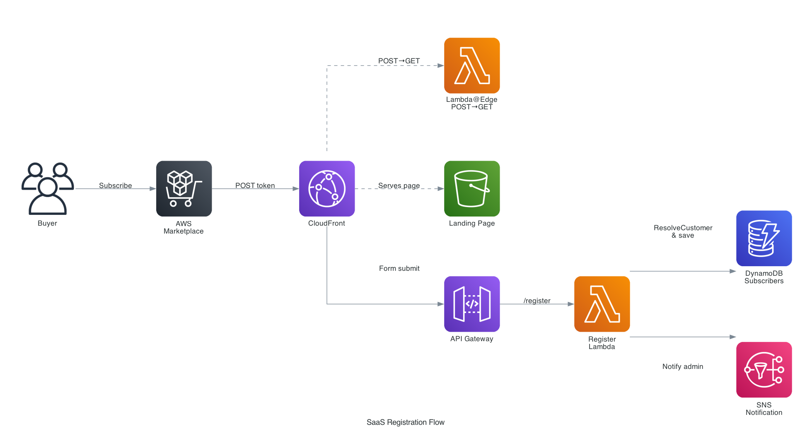
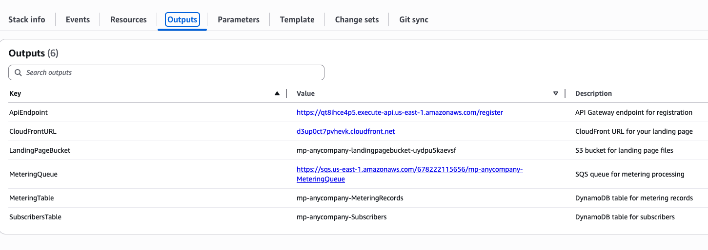
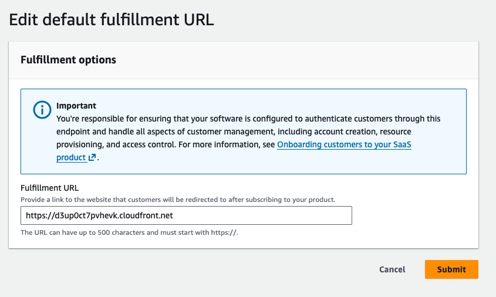
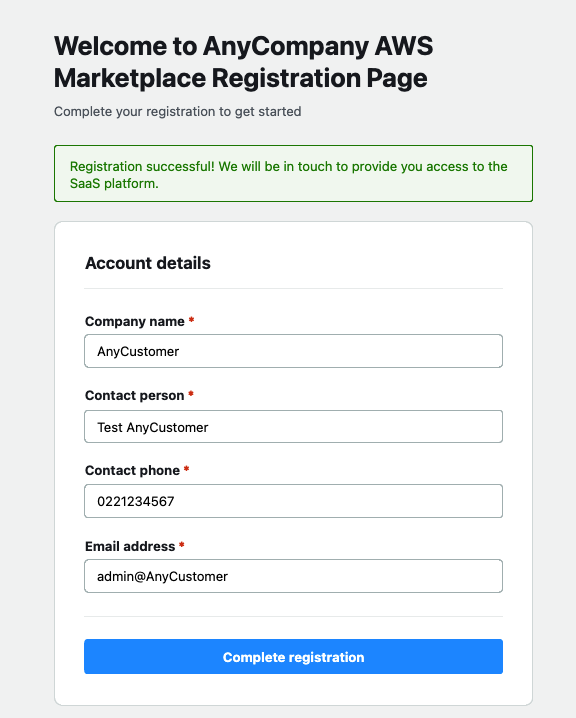
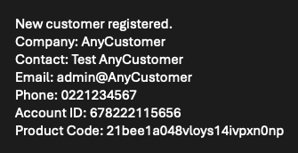

# Lab: Set Up a SaaS Registration Page for AWS Marketplace

> **Note:** The sample solution provided in this lab is intended for demonstration and learning purposes. Review the [Production Considerations](https://github.com/kevken1000/mp-registration-Page#production-considerations) before deploying to a live environment. Once deployed, you are responsible for maintaining the solution, including Lambda runtime updates, security patches, and dependency upgrades.

In this lab, you will integrate your SaaS product with AWS Marketplace. You will set up a registration landing page, verify customers using the `ResolveCustomer` API, store subscriber data, and handle subscription lifecycle events.

## What you will build

When a customer subscribes to your SaaS product on AWS Marketplace, AWS Marketplace redirects them to your registration landing page. Your registration page needs to include the following integration:

1. Accept the customer from AWS Marketplace (receive a token via POST)
2. Verify the customer by calling `ResolveCustomer` (exchange the token for a customer ID and product code)
3. Store the customer's registration details
4. Listen for subscription changes (new, amended, cancelled)
5. Report usage for metered or consumption pricing (required for SaaS Subscriptions and Contracts with Consumption)

## Prerequisites

Before starting this lab, you must have:

- [Registered as an AWS Marketplace seller](https://docs.aws.amazon.com/marketplace/latest/userguide/seller-account-registering.html)
- A SaaS product listing created (Limited or Public)
- `AWSMarketplaceSellerFullAccess` IAM permission
- AWS CLI configured or Console access

## Architecture

The following diagram shows the registration flow you will build in this lab.



1. Buyer subscribes to your product on AWS Marketplace
2. AWS Marketplace sends a POST with `x-amzn-marketplace-token` to your CloudFront URL
3. Lambda@Edge converts the POST to a GET redirect with the token as a query parameter
4. CloudFront serves the branded landing page from S3
5. Buyer fills out the registration form, which submits to API Gateway
6. The Register Lambda calls `ResolveCustomer` to verify the token and stores the subscriber in DynamoDB
7. SNS sends a notification email to the seller admin

<details>
<summary><h2>Option 1: Deploy the AWS sample solution</h2></summary>

A sample CloudFormation template deploys the complete integration in one step: registration page, APIs, database, subscription handling, and metering pipeline.

Run the following command to deploy the stack:

```bash
aws cloudformation create-stack \
    --stack-name my-marketplace-landing \
    --template-body file://cloudformation-template.yaml \
    --capabilities CAPABILITY_IAM \
    --parameters \
        ParameterKey=CompanyName,ParameterValue="Your Company" \
        ParameterKey=AdminEmail,ParameterValue=admin@example.com \
    --region us-east-1
```

You can also deploy from the [CloudFormation console](https://us-east-1.console.aws.amazon.com/cloudformation/home?region=us-east-1#/stacks/create). Upload the [template](https://github.com/kevken1000/mp-registration-Page/blob/main/templates/cloudformation-template.yaml) and fill in the parameters.

A [Terraform version](https://github.com/kevken1000/mp-registration-Page/tree/main/templates/terraform) is also available.

After deployment (~5 minutes):

1. Confirm the SNS email subscription sent to your admin email
2. Copy the CloudFront URL from the [stack outputs](https://us-east-1.console.aws.amazon.com/cloudformation/home?region=us-east-1#/stacks)

<!-- TODO: Screenshot of CloudFormation stack outputs tab showing CloudFront URL -->


3. Set it as the fulfillment URL in the [Marketplace Management Portal](https://aws.amazon.com/marketplace/management/products)

<!-- TODO: Screenshot of Marketplace Management Portal fulfillment URL field -->


The URL shown above is an example. Replace it with the CloudFront URL from your own stack outputs.

The solution is now deployed. Proceed to [Testing your integration](#testing-your-integration) to verify it works.

</details>

<details>
<summary><h2>Option 2: Build your own AWS Marketplace integration</h2></summary>

If you prefer to build the integration into your existing infrastructure, follow these steps.

### Step 1: Create a registration landing page

Your registration page is where AWS Marketplace sends customers after they subscribe. It can be a static HTML page or part of your existing web application.

Your page must meet these requirements:
- Accept a POST request from AWS Marketplace containing `x-amzn-marketplace-token` in the request body
- Extract the token and pass it to your backend for verification
- Collect customer details (company name, contact info, email)

AWS Marketplace sends a POST request, but most static pages cannot handle POST bodies directly. You need to convert the POST to a GET. There are two common approaches:

**Lambda@Edge (recommended):** Intercept the POST at the CloudFront edge, extract the token, and redirect to a GET with the token as a query parameter. This approach is fast, runs at the edge, and requires no extra API Gateway route.

**API Gateway redirect route:** Add a `/redirect` route in API Gateway that receives the POST, extracts the token, and returns a 302 redirect. The [aws-samples reference implementation](https://github.com/aws-samples/aws-marketplace-serverless-saas-integration) uses this approach.

The following code example shows a Lambda@Edge redirect function:

```javascript
exports.handler = async (event) => {
    const request = event.Records[0].cf.request;
    if (request.method === 'POST' && request.body && request.body.data) {
        const body = Buffer.from(request.body.data, 'base64').toString();
        const params = new URLSearchParams(body);
        const token = params.get('x-amzn-marketplace-token');
        if (token) {
            return {
                status: '302',
                statusDescription: 'Found',
                headers: {
                    location: [{
                        key: 'Location',
                        value: '/?x-amzn-marketplace-token=' + encodeURIComponent(token)
                    }]
                }
            };
        }
    }
    return request;
};
```

### Step 2: Verify the customer with ResolveCustomer

When the customer submits the registration form, your backend calls `ResolveCustomer` with the token. This exchanges the temporary token for the customer's identity.

The following code example shows how to call `ResolveCustomer`:

```javascript
const { MarketplaceMetering } = require('@aws-sdk/client-marketplace-metering');
const marketplace = new MarketplaceMetering();

const result = await marketplace.resolveCustomer({
    RegistrationToken: token
});

// result contains:
// - CustomerIdentifier (Marketplace-generated ID)
// - CustomerAWSAccountId (their AWS account ID)
// - ProductCode (which product they subscribed to)
```

Note the following:
- The token is valid for 4 hours after the redirect
- `ResolveCustomer` must be called from the same AWS account that published the product
- The response includes the `ProductCode`, so one registration page can serve multiple products
- AWS recommends using `CustomerAWSAccountId` for new integrations (over `CustomerIdentifier`)

Your Lambda execution role needs the following IAM permission:

```json
{
    "Effect": "Allow",
    "Action": "aws-marketplace:ResolveCustomer",
    "Resource": "*"
}
```

### Step 3: Store the customer record

After verifying the customer, store their details. A DynamoDB table works well for this. The following table shows the recommended schema:

| Attribute | Description |
|-----------|-------------|
| `productCode` (partition key) | Which product they subscribed to |
| `customerAWSAccountId` (sort key) | Their AWS account ID |
| `customerIdentifier` | Marketplace-generated customer ID |
| `companyName` | From the registration form |
| `contactPerson` | From the registration form |
| `contactEmail` | From the registration form |
| `registrationDate` | Timestamp |
| `status` | `active`, `cancelled`, etc. |

Using `productCode` as the partition key and `customerAWSAccountId` as the sort key lets one table serve multiple products.

### Step 4: Send a notification

Notify your team when a new customer registers. An SNS topic with an email subscription is the simplest approach.

The following code example shows how to publish a notification:

```javascript
const { SNSClient, PublishCommand } = require('@aws-sdk/client-sns');
const sns = new SNSClient();

await sns.send(new PublishCommand({
    TopicArn: process.env.SNS_TOPIC_ARN,
    Subject: 'New Registration: ' + companyName,
    Message: `Company: ${companyName}\nContact: ${contactPerson}\nEmail: ${contactEmail}\nAccount: ${customerAWSAccountId}\nProduct: ${productCode}`
}));
```

### Step 5: Handle subscription lifecycle events

Customers can upgrade, downgrade, or cancel their subscriptions. You need to listen for these changes and update your records accordingly.

**Recommended approach: EventBridge**

AWS Marketplace publishes agreement and license events to EventBridge. Create a rule to capture them using the following event pattern:

```json
{
    "source": ["aws.agreement-marketplace"],
    "detail-type": [
        "Purchase Agreement Created - Manufacturer",
        "Purchase Agreement Amended - Manufacturer",
        "Purchase Agreement Ended - Manufacturer",
        "License Updated - Manufacturer",
        "License Deprovisioned - Manufacturer"
    ]
}
```

Your Lambda handler receives the event and updates the subscriber status in DynamoDB.

**Alternative approach: SNS topics**

The older approach uses product-specific SNS topics provided by AWS Marketplace. You subscribe an SQS queue to the topic and process messages with a Lambda function. This requires the product code at setup time and needs separate subscriptions per product.

### Step 6: Set the fulfillment URL

In the [Marketplace Management Portal](https://aws.amazon.com/marketplace/management/products):

1. Select your SaaS product
2. Set the fulfillment URL to your registration page URL (CloudFront domain or custom domain)
3. Submit the update

</details>

## Testing your integration

To verify your integration is working:

1. Go to your product listing in the Marketplace Management Portal
2. Choose "View on AWS Marketplace" to see the buyer experience
3. Subscribe to your own product as a test buyer
4. Verify you are redirected to your registration page with the token

<!-- TODO: Screenshot of the deployed landing page in a browser -->


5. Complete the registration form
6. Check DynamoDB for the new subscriber record

<!-- TODO: Screenshot of DynamoDB console showing the subscriber record -->


7. Check your email for the SNS notification

<!-- TODO: Screenshot of the SNS notification email -->


For detailed testing guidance, see [Successfully testing your SaaS listing in AWS Marketplace](https://aws.amazon.com/blogs/awsmarketplace/successfully-testing-your-saas-listing-in-aws-marketplace/).

## What about metering?

If your product uses usage-based pricing (SaaS Subscriptions or Contracts with Consumption), you need to report customer usage to AWS Marketplace. This is covered in a separate lab: [SaaS Metering Integration](saas-metering.md).

For contract-only products with no usage component, metering is not required.

## Prepare for product review

Before you can update your product's visibility from Limited to Public, the AWS Marketplace Seller Operations team will review and audit your product. As part of this review, the team needs to verify that your integration works end to end, from subscribing on AWS Marketplace through to accessing your SaaS application.

The Seller Operations team will subscribe to your product and complete the registration form on your landing page. After registration, they need to verify they can access your SaaS application. You must provide one of the following:

1. Login credentials to your SaaS application so the team can verify the full customer experience after registration
2. If you are unable to provide login access, submit a video walkthrough that demonstrates the complete flow

Your video should cover:

1. Subscribing to the product from the AWS Marketplace listing page
2. Being redirected to the registration landing page
3. Completing the registration form
4. Logging in and accessing the SaaS application
5. If applicable, demonstrating that metering records are being sent via `BatchMeterUsage`

The review process takes 7 to 10 business days. If the team finds issues, the status changes to "Action Required" and you will need to address them before resubmitting. For more information, see [SaaS product guidelines](https://docs.aws.amazon.com/marketplace/latest/userguide/saas-guidelines.html) and [Submitting your product for publication](https://docs.aws.amazon.com/marketplace/latest/userguide/product-submission.html).

To contact the Seller Operations team or check the status of your submission, visit the [AWS Marketplace Management Portal](https://aws.amazon.com/marketplace/management/contact-us/).

## Clean up

If you deployed the sample solution and want to remove it:

**CloudFormation:**
```bash
aws cloudformation delete-stack --stack-name my-marketplace-landing --region us-east-1
```

**Terraform:**
```bash
cd templates/terraform
terraform destroy
```

Note: Lambda@Edge functions take up to an hour to delete after stack deletion. For CloudFormation, use `--retain-resources RedirectFunction` if you need to delete the stack quickly. For Terraform, re-run `terraform destroy` after a few minutes if it times out.

## Conclusion

In this lab, you set up a SaaS integration with AWS Marketplace. You now have a registration landing page that accepts customers, verifies them with `ResolveCustomer`, stores their details, and listens for subscription lifecycle events. For usage-based pricing, continue to the [SaaS Metering Integration](saas-metering.md) lab.

## Resources

- [Sample solution (CloudFormation + Terraform)](https://github.com/kevken1000/mp-registration-Page)
- [Step-by-Step Guide to SaaS Integration with AWS Marketplace](https://aws.amazon.com/blogs/awsmarketplace/step-by-step-guide-to-saas-integration-with-aws-marketplace/)
- [ResolveCustomer API reference](https://docs.aws.amazon.com/marketplace/latest/APIReference/API_marketplace-metering_ResolveCustomer.html)
- [BatchMeterUsage API reference](https://docs.aws.amazon.com/marketplace/latest/APIReference/API_marketplace-metering_BatchMeterUsage.html)
- [SaaS Seller Guide](https://docs.aws.amazon.com/marketplace/latest/userguide/saas-products.html)
- [AWS Marketplace SaaS Integration Reference](https://github.com/aws-samples/aws-marketplace-serverless-saas-integration)
